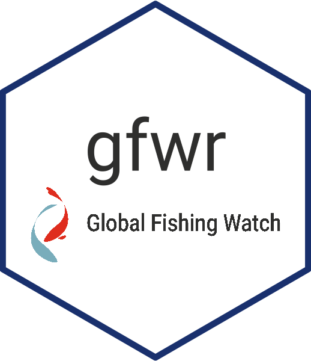

<!-- README.md is generated from README.Rmd. Please edit that file -->

# `gfwr`: Access data from Global Fishing Watch APIs 

<!-- badges: start -->

[](https://zenodo.org/badge/latestdoi/450635054)
[](https://www.repostatus.org/#active)
[](https://opensource.org/licenses/Apache-2.0)
[](https://github.com/r-universe/globalfishingwatch/actions/workflows/sync.yml)
<!-- badges: end -->

> **Important**  
> This version of gfwr gives access to Global Fishing Watch API [version
> 3](https://globalfishingwatch.org/our-apis/documentation#version-3-api).
> Starting April 30th, 2024, this is the official API version. To
> install gfwr 1.0, the previous version that communicated with API
> [version
> 2](https://globalfishingwatch.org/our-apis/documentation#version-2-api),
> please refer to branch `APIv2` in this repository.
> `remotes::install_github("GlobalFishingWatch/gfwr", ref = "APIv2")`

The `gfwr` R package is a simple wrapper for the Global Fishing Watch
(GFW)
[APIs](https://globalfishingwatch.org/our-apis/documentation#introduction).
It provides convenient functions to freely pull GFW data directly into R
in tidy formats.

The package currently works with the following APIs:

- [Vessels
  API](https://globalfishingwatch.org/our-apis/documentation#vessels-api):
  vessel search and identity based on AIS self reported data
- [Events
  API](https://globalfishingwatch.org/our-apis/documentation#events-api):
  encounters, loitering, port visits and fishing events based on AIS
  data
- [Map Visualization (4Wings
  API)](https://globalfishingwatch.org/our-apis/documentation#map-visualization-4wings-api):
  apparent fishing effort based on AIS data

> **Note**: See the [Terms of
> Use](https://globalfishingwatch.org/our-apis/documentation#reference-data)
> page for GFW APIs for information on our API licenses and rate limits.

## Installation

You can install the most recent version of `gfwr` using:

``` r
# Check/install remotes
if (!require("remotes"))
  install.packages("remotes")

remotes::install_github("GlobalFishingWatch/gfwr")
```

`gfwr` is also in rOpenSci
[R-universe](https://globalfishingwatch.r-universe.dev/gfwr#), and can
be installed like this:

``` r
install.packages("gfwr", 
                 repos = c("https://globalfishingwatch.r-universe.dev",
                           "https://cran.r-project.org"))
```

Once everything is installed, you can load and use `gfwr` in your
scripts with `library(gfwr)`

``` r
library(gfwr)
```

## Authorization

The use of `gfwr` requires a GFW API token, which users can request from
the [GFW API Portal](https://globalfishingwatch.org/our-apis/tokens).
Save this token to your `.Renviron` file using
`usethis::edit_r_environ()` and adding a variable named `GFW_TOKEN` to
the file (`GFW_TOKEN="PASTE_YOUR_TOKEN_HERE"`). Save the `.Renviron`
file and restart the R session to make the edit effective.

Then use the `gfw_auth()` helper function to save the information to an
object in your R workspace every time you need to extract the token and
pass it to subsequent `gfwr` functions.

So you can do:

``` r
key <- gfw_auth()
```

or this

``` r
key <- Sys.getenv("GFW_TOKEN")
```

> **Note**: `gfwr` functions are set to use `key = gfw_auth()` by
> default.

## Vessels API

The `get_vessel_info()` function allows you to get vessel identity
details from the [GFW Vessels
API](https://globalfishingwatch.org/our-apis/documentation#introduction-vessels-api).

There are two search types: `search`, and `id`.

- `search` is performed by using parameters `query` for basic searches
  and `where` for advanced searchers using SQL expressions
  - `query` takes a single identifier that can be the MMSI, IMO,
    callsign, or shipname as input and identifies all vessels that
    match.
  - `where` search allows for the use of complex search with logical
    clauses (AND, OR) and fuzzy matching with terms such as LIKE, using
    SQL syntax (see examples in the function)
  - `includes` adds information from public registries. Options are
    “MATCH_CRITERIA”, “OWNERSHIP” and “AUTHORIZATIONS”

### Examples

To get information of a vessel using its MMSI, IMO number, callsign or
name, the search can be done directly using the number or the string.
For example, to look for a vessel with `MMSI = 224224000`:

``` r
get_vessel_info(query = 224224000,
                search_type = "search",
                key = key)
#> $dataset
#> # A tibble: 1 × 1
#>   dataset                                
#>   <chr>                                  
#> 1 public-global-vessel-identity:v20231026
#> 
#> $registryInfoTotalRecords
#> # A tibble: 1 × 1
#>   registryInfoTotalRecords
#>                      <int>
#> 1                        1
#> 
#> $registryInfo
#> # A tibble: 1 × 15
#>   id                    sourceCode ssvid flag  shipname nShipname callsign imo  
#>   <chr>                 <list>     <chr> <chr> <chr>    <chr>     <chr>    <chr>
#> 1 e0c9823749264a129d6b… <chr [6]>  2242… ESP   AGURTZA… AGURTZAB… EBSJ     8733…
#> # ℹ 7 more variables: latestVesselInfo <lgl>, transmissionDateFrom <chr>,
#> #   transmissionDateTo <chr>, geartypes <list>, lengthM <dbl>, tonnageGt <int>,
#> #   vesselInfoReference <chr>
#> 
#> $registryOwners
#> # A tibble: 2 × 6
#>   name             flag  ssvid     sourceCode dateFrom             dateTo       
#>   <chr>            <chr> <chr>     <list>     <chr>                <chr>        
#> 1 JEALSA RIANXEIRA ESP   306118000 <chr [1]>  2019-10-15T12:47:53Z 2023-09-15T1…
#> 2 JEALSA RIANXEIRA ESP   224224000 <chr [1]>  2015-10-13T16:06:33Z 2019-10-15T0…
#> 
#> $registryPublicAuthorizations
#> # A tibble: 4 × 4
#>   dateFrom             dateTo               ssvid     sourceCode
#>   <chr>                <chr>                <chr>     <list>    
#> 1 2019-10-15T00:00:00Z 2023-02-01T00:00:00Z 306118000 <chr [1]> 
#> 2 2018-01-09T00:00:00Z 2019-10-24T00:00:00Z 224224000 <chr [1]> 
#> 3 2012-01-01T00:00:00Z 2019-01-01T00:00:00Z 224224000 <chr [1]> 
#> 4 2014-03-11T00:00:00Z 2016-07-28T00:00:00Z 224224000 <chr [1]> 
#> 
#> $combinedSourcesInfo
#> # A tibble: 2 × 9
#>   vesselId  geartypes_geartype_n…¹ geartypes_geartype_s…² geartypes_geartype_y…³
#>   <chr>     <chr>                  <chr>                                   <int>
#> 1 3c99c326… PURSE_SEINE_SUPPORT    GFW_VESSEL_LIST                          2015
#> 2 6632c9eb… PURSE_SEINE_SUPPORT    GFW_VESSEL_LIST                          2019
#> # ℹ abbreviated names: ¹​geartypes_geartype_name, ²​geartypes_geartype_source,
#> #   ³​geartypes_geartype_yearFrom
#> # ℹ 5 more variables: geartypes_geartype_yearTo <int>,
#> #   shiptypes_shiptype_name <chr>, shiptypes_shiptype_source <chr>,
#> #   shiptypes_shiptype_yearFrom <int>, shiptypes_shiptype_yearTo <int>
#> 
#> $selfReportedInfo
#> # A tibble: 2 × 13
#>   id               ssvid shipname nShipname flag  callsign imo   messagesCounter
#>   <chr>            <chr> <chr>    <chr>     <chr> <chr>    <chr>           <int>
#> 1 6632c9eb8-8009-… 3061… AGURTZA… AGURTZAB… BES   PJBL     8733…        21772378
#> 2 3c99c326d-dd2e-… 2242… AGURTZA… AGURTZAB… ESP   EBSJ     8733…         1887249
#> # ℹ 5 more variables: positionsCounter <int>, sourceCode <list>,
#> #   matchFields <chr>, transmissionDateFrom <chr>, transmissionDateTo <chr>
```

To do more specific searches (`imo = '8300949'`), combine different
fields (`imo = '8300949' AND ssvid = '214182732'`) and do fuzzy matching
(`"shipname LIKE '%GABU REEFE%' OR imo = '8300949'"`), use parameter
`where` instead of `query`:

``` r
get_vessel_info(where = "shipname LIKE '%GABU REEFE%' OR imo = '8300949'",
                search_type = "search",
                key = key)
#> $dataset
#> # A tibble: 1 × 1
#>   dataset                                
#>   <chr>                                  
#> 1 public-global-vessel-identity:v20231026
#> 
#> $registryInfoTotalRecords
#> # A tibble: 1 × 1
#>   registryInfoTotalRecords
#>                      <int>
#> 1                        1
#> 
#> $registryInfo
#> # A tibble: 1 × 15
#>   id                    sourceCode ssvid flag  shipname nShipname callsign imo  
#>   <chr>                 <list>     <chr> <chr> <chr>    <chr>     <chr>    <chr>
#> 1 b16ca93ea690fc725e92… <chr [2]>  6135… CMR   GABU RE… GABUREEF… TJMC996  8300…
#> # ℹ 7 more variables: latestVesselInfo <lgl>, transmissionDateFrom <chr>,
#> #   transmissionDateTo <chr>, geartypes <list>, lengthM <dbl>, tonnageGt <int>,
#> #   vesselInfoReference <chr>
#> 
#> $registryOwners
#> # A tibble: 3 × 6
#>   name                   flag  ssvid     sourceCode dateFrom             dateTo 
#>   <chr>                  <chr> <chr>     <list>     <chr>                <chr>  
#> 1 FISHING CARGO SERVICES PAN   613590000 <chr [1]>  2022-01-24T09:16:50Z 2024-0…
#> 2 FISHING CARGO SERVICES PAN   214182732 <chr [1]>  2019-02-23T11:06:32Z 2022-0…
#> 3 FISHING CARGO SERVICES PAN   616852000 <chr [1]>  2014-01-04T11:52:41Z 2019-0…
#> 
#> $registryPublicAuthorizations
#> # A tibble: 0 × 1
#> # ℹ 1 variable: <list> <list>
#> 
#> $combinedSourcesInfo
#> # A tibble: 3 × 9
#>   vesselId  geartypes_geartype_n…¹ geartypes_geartype_s…² geartypes_geartype_y…³
#>   <chr>     <chr>                  <chr>                                   <int>
#> 1 0b7047cb… CARRIER                GFW_VESSEL_LIST                          2019
#> 2 1da8dbc2… CARRIER                GFW_VESSEL_LIST                          2022
#> 3 58cf536b… CARRIER                GFW_VESSEL_LIST                          2012
#> # ℹ abbreviated names: ¹​geartypes_geartype_name, ²​geartypes_geartype_source,
#> #   ³​geartypes_geartype_yearFrom
#> # ℹ 5 more variables: geartypes_geartype_yearTo <int>,
#> #   shiptypes_shiptype_name <chr>, shiptypes_shiptype_source <chr>,
#> #   shiptypes_shiptype_yearFrom <int>, shiptypes_shiptype_yearTo <int>
#> 
#> $selfReportedInfo
#> # A tibble: 3 × 13
#>   id               ssvid shipname nShipname flag  callsign imo   messagesCounter
#>   <chr>            <chr> <chr>    <chr>     <chr> <chr>    <chr>           <int>
#> 1 1da8dbc23-3c48-… 6135… GABU RE… GABUREEF… CMR   TJMC996  8300…        71695035
#> 2 0b7047cb5-58c8-… 2141… GABU RE… GABUREEF… MDA   ER2732   8300…        70035084
#> 3 58cf536b1-1fca-… 6168… GABU RE… GABUREEF… COM   D6FJ2    8300…        32121624
#> # ℹ 5 more variables: positionsCounter <int>, sourceCode <list>,
#> #   matchFields <chr>, transmissionDateFrom <chr>, transmissionDateTo <chr>
```

- The `id` search allows the user to specify a vector of `vessel id`

> **Note**: `vessel id` is an internal ID generated by GFW to connect
> data accross APIs and involves a combination of vessel and tracking
> data information. It can be retrieved using `get_vessel_info()` as
> shown above.

To search using `vessel id`:

``` r
get_vessel_info(ids = "8c7304226-6c71-edbe-0b63-c246734b3c01",
                search_type = "id",
                key = key)
#> $dataset
#> # A tibble: 1 × 1
#>   dataset                                
#>   <chr>                                  
#> 1 public-global-vessel-identity:v20231026
#> 
#> $registryInfoTotalRecords
#> # A tibble: 1 × 1
#>   registryInfoTotalRecords
#>                      <int>
#> 1                        2
#> 
#> $registryInfo
#> # A tibble: 2 × 15
#>   id                    sourceCode ssvid flag  shipname nShipname callsign imo  
#>   <chr>                 <list>     <chr> <chr> <chr>    <chr>     <chr>    <chr>
#> 1 a8d00ce54b37add7f85a… <chr [6]>  2106… CYP   FRIO FO… FRIOFORW… 5BWC3    9076…
#> 2 a8d00ce54b37add7f85a… <chr [2]>  2733… RUS   FRIO FO… FRIOFORW… UCRZ     9076…
#> # ℹ 7 more variables: latestVesselInfo <lgl>, transmissionDateFrom <chr>,
#> #   transmissionDateTo <chr>, geartypes <list>, lengthM <int>, tonnageGt <int>,
#> #   vesselInfoReference <chr>
#> 
#> $registryOwners
#> # A tibble: 2 × 6
#>   name    flag  ssvid     sourceCode dateFrom             dateTo              
#>   <chr>   <chr> <chr>     <list>     <chr>                <chr>               
#> 1 COLINER CYP   210631000 <chr [1]>  2014-01-01T00:16:58Z 2024-04-30T23:41:06Z
#> 2 COLINER CYP   273379740 <chr [1]>  2015-02-27T10:59:43Z 2018-03-21T07:13:09Z
#> 
#> $registryPublicAuthorizations
#> # A tibble: 2 × 4
#>   dateFrom             dateTo               ssvid     sourceCode
#>   <chr>                <chr>                <chr>     <list>    
#> 1 2022-12-19T00:00:00Z 2024-05-01T00:00:00Z 210631000 <chr [1]> 
#> 2 2020-01-01T00:00:00Z 2024-05-01T00:00:00Z 210631000 <chr [1]> 
#> 
#> $combinedSourcesInfo
#> # A tibble: 2 × 9
#>   vesselId  geartypes_geartype_n…¹ geartypes_geartype_s…² geartypes_geartype_y…³
#>   <chr>     <chr>                  <chr>                                   <int>
#> 1 da1cd7e1… CARRIER                GFW_VESSEL_LIST                          2015
#> 2 8c730422… CARRIER                GFW_VESSEL_LIST                          2013
#> # ℹ abbreviated names: ¹​geartypes_geartype_name, ²​geartypes_geartype_source,
#> #   ³​geartypes_geartype_yearFrom
#> # ℹ 5 more variables: geartypes_geartype_yearTo <int>,
#> #   shiptypes_shiptype_name <chr>, shiptypes_shiptype_source <chr>,
#> #   shiptypes_shiptype_yearFrom <int>, shiptypes_shiptype_yearTo <int>
#> 
#> $selfReportedInfo
#> # A tibble: 1 × 13
#>   id               ssvid shipname nShipname flag  callsign imo   messagesCounter
#>   <chr>            <chr> <chr>    <chr>     <chr> <chr>    <chr>           <int>
#> 1 8c7304226-6c71-… 2106… FRIO FO… FRIOFORW… CYP   5BWC3    9076…       262953205
#> # ℹ 5 more variables: positionsCounter <int>, sourceCode <list>,
#> #   matchFields <chr>, transmissionDateFrom <chr>, transmissionDateTo <chr>
```

To specify more than one `vessel id`, you can submit a vector of
identifiers:

``` r
get_vessel_info(ids = c("8c7304226-6c71-edbe-0b63-c246734b3c01",
                        "6583c51e3-3626-5638-866a-f47c3bc7ef7c",
                        "71e7da672-2451-17da-b239-857831602eca"),
                search_type = 'id',
                key = key)
#> $dataset
#> # A tibble: 3 × 1
#>   dataset                                
#>   <chr>                                  
#> 1 public-global-vessel-identity:v20231026
#> 2 public-global-vessel-identity:v20231026
#> 3 public-global-vessel-identity:v20231026
#> 
#> $registryInfoTotalRecords
#> # A tibble: 3 × 1
#>   registryInfoTotalRecords
#>                      <int>
#> 1                        2
#> 2                        1
#> 3                        1
#> 
#> $registryInfo
#> # A tibble: 4 × 15
#>   id                    sourceCode ssvid flag  shipname nShipname callsign imo  
#>   <chr>                 <list>     <chr> <chr> <chr>    <chr>     <chr>    <chr>
#> 1 a8d00ce54b37add7f85a… <chr [6]>  2106… CYP   FRIO FO… FRIOFORW… 5BWC3    9076…
#> 2 a8d00ce54b37add7f85a… <chr [2]>  2733… RUS   FRIO FO… FRIOFORW… UCRZ     9076…
#> 3 685862e0626f6234c844… <chr [5]>  5480… PHL   JOHNREY… JOHNREYN… DUQA7    8118…
#> 4 b82d02e5c2c11e5fe536… <chr [5]>  4417… KOR   ADRIA    ADRIA     DTBY3    8919…
#> # ℹ 7 more variables: latestVesselInfo <lgl>, transmissionDateFrom <chr>,
#> #   transmissionDateTo <chr>, geartypes <list>, lengthM <dbl>, tonnageGt <dbl>,
#> #   vesselInfoReference <chr>
#> 
#> $registryOwners
#> # A tibble: 4 × 6
#>   name                          flag  ssvid     sourceCode dateFrom       dateTo
#>   <chr>                         <chr> <chr>     <list>     <chr>          <chr> 
#> 1 COLINER                       CYP   210631000 <chr [1]>  2014-01-01T00… 2024-…
#> 2 COLINER                       CYP   273379740 <chr [1]>  2015-02-27T10… 2018-…
#> 3 TRANS PACIFIC JOURNEY FISHING PHL   548012100 <chr [3]>  2017-02-07T00… 2019-…
#> 4 DONGWON INDUSTRIES            KOR   441734000 <chr [2]>  2014-01-18T19… 2024-…
#> 
#> $registryPublicAuthorizations
#> # A tibble: 6 × 4
#>   dateFrom             dateTo               ssvid     sourceCode
#>   <chr>                <chr>                <chr>     <list>    
#> 1 2022-12-19T00:00:00Z 2024-05-01T00:00:00Z 210631000 <chr [1]> 
#> 2 2020-01-01T00:00:00Z 2024-05-01T00:00:00Z 210631000 <chr [1]> 
#> 3 2012-01-01T00:00:00Z 2024-05-01T00:00:00Z 548012100 <chr [1]> 
#> 4 2012-01-01T00:00:00Z 2017-10-25T00:00:00Z 548012100 <chr [1]> 
#> 5 2013-09-20T00:00:00Z 2024-05-01T00:00:00Z 441734000 <chr [1]> 
#> 6 2015-10-08T00:00:00Z 2020-07-21T00:00:00Z 441734000 <chr [1]> 
#> 
#> $combinedSourcesInfo
#> # A tibble: 8 × 9
#>   vesselId  geartypes_geartype_n…¹ geartypes_geartype_s…² geartypes_geartype_y…³
#>   <chr>     <chr>                  <chr>                                   <int>
#> 1 da1cd7e1… CARRIER                GFW_VESSEL_LIST                          2015
#> 2 8c730422… CARRIER                GFW_VESSEL_LIST                          2013
#> 3 55889aef… TUNA_PURSE_SEINES      COMBINATION_OF_REGIST…                   2017
#> 4 71e7da67… TUNA_PURSE_SEINES      COMBINATION_OF_REGIST…                   2017
#> 5 6583c51e… OTHER                  COMBINATION_OF_REGIST…                   2013
#> 6 6583c51e… OTHER                  COMBINATION_OF_REGIST…                   2013
#> 7 6583c51e… TUNA_PURSE_SEINES      COMBINATION_OF_REGIST…                   2014
#> 8 6583c51e… TUNA_PURSE_SEINES      COMBINATION_OF_REGIST…                   2014
#> # ℹ abbreviated names: ¹​geartypes_geartype_name, ²​geartypes_geartype_source,
#> #   ³​geartypes_geartype_yearFrom
#> # ℹ 5 more variables: geartypes_geartype_yearTo <int>,
#> #   shiptypes_shiptype_name <chr>, shiptypes_shiptype_source <chr>,
#> #   shiptypes_shiptype_yearFrom <int>, shiptypes_shiptype_yearTo <int>
#> 
#> $selfReportedInfo
#> # A tibble: 3 × 13
#>   id               ssvid shipname nShipname flag  callsign imo   messagesCounter
#>   <chr>            <chr> <chr>    <chr>     <chr> <chr>    <chr>           <int>
#> 1 8c7304226-6c71-… 2106… FRIO FO… FRIOFORW… CYP   5BWC3    9076…       262953205
#> 2 71e7da672-2451-… 5480… JOHN RE… JOHNREYN… PHL   DUQA-7   8118…         1967237
#> 3 6583c51e3-3626-… 4417… ADRIA    ADRIA     KOR   DTBY3    8919…         3742574
#> # ℹ 5 more variables: positionsCounter <int>, sourceCode <list>,
#> #   matchFields <chr>, transmissionDateFrom <chr>, transmissionDateTo <chr>
```

Check the function documentation for examples about the other argument
options.

## Events API

The `get_event()` function allows you to get data on specific vessel
activities from the [GFW Events
API](https://globalfishingwatch.org/our-apis/documentation#events-api).
Event types include apparent fishing events, potential transshipment
events (two-vessel encounters and loitering by refrigerated carrier
vessels), port visits, and AIS-disabling events (“gaps”). Find more
information in our [caveat
documentation](https://globalfishingwatch.org/our-apis/documentation#data-caveat).

### Examples

The Events API uses `vesselId` as input, so you always need to use
`get_vessel_info()` first to extract `vesselId` from the
`$selfReportedInfo` data and then use it in the `get_event()` function.

``` r
vessel_info <- get_vessel_info(query = 224224000, key = key)

id <- vessel_info$selfReportedInfo$id[1]
```

To get a list of port visits for that vessel:

``` r
get_event(event_type = 'PORT_VISIT',
          vessels = id,
          confidences = 4,
          key = key
          )
#> [1] "Downloading 24 events from GFW"
#> # A tibble: 24 × 11
#>    start               end                 id    type    lat    lon regions     
#>    <dttm>              <dttm>              <chr> <chr> <dbl>  <dbl> <list>      
#>  1 2019-11-15 14:15:11 2019-11-19 07:49:20 bbee… port…  5.22  -4.00 <named list>
#>  2 2019-12-06 11:02:09 2019-12-11 10:20:04 bcd9… port…  5.22  -4.01 <named list>
#>  3 2020-01-11 11:18:49 2020-01-15 11:54:49 889b… port…  5.23  -4.01 <named list>
#>  4 2020-01-27 08:04:38 2020-02-23 10:18:02 abed… port… 16.9  -25.0  <named list>
#>  5 2020-02-23 12:44:03 2020-02-24 10:35:02 672b… port… 16.9  -25.0  <named list>
#>  6 2020-03-05 13:28:59 2020-04-05 15:03:18 f539… port…  5.26  -4.03 <named list>
#>  7 2020-04-19 06:16:46 2020-04-21 14:02:19 5ad5… port… 28.1  -15.4  <named list>
#>  8 2020-05-05 06:52:54 2020-05-07 14:22:35 729d… port…  5.23  -4.00 <named list>
#>  9 2020-06-10 13:51:11 2020-06-13 13:51:28 8f14… port…  5.21  -4.05 <named list>
#> 10 2020-06-20 12:33:45 2020-06-20 19:43:10 a8f5… port… 14.7  -17.4  <named list>
#> # ℹ 14 more rows
#> # ℹ 4 more variables: boundingBox <list>, distances <list>, vessel <list>,
#> #   event_info <list>
```

We can also use more than one `vessel id`:

``` r
get_event(event_type = 'PORT_VISIT',
          vessels = c('8c7304226-6c71-edbe-0b63-c246734b3c01', '6583c51e3-3626-5638-866a-f47c3bc7ef7c'),
          confidences = 4,
          start_date = "2020-01-01",
          end_date = "2020-02-01",
          key = key
          )
#> [1] "Downloading 3 events from GFW"
#> # A tibble: 3 × 11
#>   start               end                 id      type    lat   lon regions     
#>   <dttm>              <dttm>              <chr>   <chr> <dbl> <dbl> <list>      
#> 1 2019-12-19 23:05:31 2020-01-24 19:05:18 7cd1e3… port…  28.1 -15.4 <named list>
#> 2 2020-01-26 05:52:47 2020-01-29 14:39:33 c2f096… port…  20.8 -17.0 <named list>
#> 3 2020-01-31 02:20:08 2020-02-03 15:56:31 7c06e4… port…  28.1 -15.4 <named list>
#> # ℹ 4 more variables: boundingBox <list>, distances <list>, vessel <list>,
#> #   event_info <list>
```

Or get encounters for all vessels in a given date range:

``` r
get_event(event_type = 'ENCOUNTER',
          start_date = "2020-01-01",
          end_date = "2020-01-02",
          key = key
          )
#> [1] "Downloading 248 events from GFW"
#> # A tibble: 248 × 11
#>    start               end                 id    type    lat    lon regions     
#>    <dttm>              <dttm>              <chr> <chr> <dbl>  <dbl> <list>      
#>  1 2019-12-17 14:10:00 2020-01-02 04:10:00 8c07… enco… 67.5    15.5 <named list>
#>  2 2019-12-17 14:10:00 2020-01-02 04:10:00 8c07… enco… 67.5    15.5 <named list>
#>  3 2019-12-26 00:20:00 2020-01-07 23:50:00 59d4… enco… -1.82 -113.  <named list>
#>  4 2019-12-26 00:20:00 2020-01-07 23:50:00 59d4… enco… -1.82 -113.  <named list>
#>  5 2019-12-26 14:10:00 2020-01-03 05:30:00 60c1… enco… -1.79 -113.  <named list>
#>  6 2019-12-26 14:10:00 2020-01-03 05:30:00 60c1… enco… -1.79 -113.  <named list>
#>  7 2019-12-27 09:10:00 2020-01-06 14:00:00 2159… enco…  9.50  -99.1 <named list>
#>  8 2019-12-27 09:10:00 2020-01-06 14:00:00 2159… enco…  9.50  -99.1 <named list>
#>  9 2019-12-30 02:20:00 2020-01-13 05:40:00 87de… enco… -1.84 -111.  <named list>
#> 10 2019-12-30 02:20:00 2020-01-13 05:40:00 87de… enco… -1.84 -111.  <named list>
#> # ℹ 238 more rows
#> # ℹ 4 more variables: boundingBox <list>, distances <list>, vessel <list>,
#> #   event_info <list>
```

When a date range is provided to `get_event()` using both `start_date`
and `end_date`, any event overlapping that range will be returned,
including events that start prior to `start_date` or end after
`end_date`. If just `start_date` or `end_date` are provided, results
will include all events that end after `start_date` or begin prior to
`end_date`, respectively.

> **Note**:  
> Because encounter events are events between two vessels, a single
> event will be represented twice in the data, once for each vessel. To
> capture this information and link the related data rows, the `id`
> field for encounter events includes an additional suffix (1 or 2)
> separated by a period. The `vessel` field will also contain different
> information specific to each vessel.

As another example, let’s combine the Vessels and Events APIs to get
fishing events for a list of 20 USA-flagged trawlers:

``` r
# Download the list of USA trawlers
usa_trawlers <- get_vessel_info(
  where = "flag='USA' AND geartypes='TRAWLERS'",
  search_type = "search",
  key = key
)
# Pass the vector of vessel ids to Events API
usa_trawler_ids <- usa_trawlers$selfReportedInfo$id[1:20]
```

> *Note*: `get_event()` can receive up to 20 vessel ids at a time

Now get the list of fishing events for these trawlers in January, 2020:

``` r
get_event(event_type = 'FISHING',
          vessels = usa_trawler_ids,
          start_date = "2020-01-01",
          end_date = "2020-02-01",
          key = key
          )
#> [1] "Downloading 34 events from GFW"
#> # A tibble: 34 × 11
#>    start               end                 id    type    lat    lon regions     
#>    <dttm>              <dttm>              <chr> <chr> <dbl>  <dbl> <list>      
#>  1 2020-01-05 04:58:45 2020-01-05 06:31:45 379d… fish…  43.7 -124.  <named list>
#>  2 2020-01-07 05:10:47 2020-01-07 08:57:13 72d1… fish…  28.1  -93.9 <named list>
#>  3 2020-01-08 19:39:55 2020-01-08 22:43:54 94fd… fish…  43.8 -124.  <named list>
#>  4 2020-01-09 12:30:54 2020-01-09 17:44:54 51c5… fish…  38.4  -73.5 <named list>
#>  5 2020-01-09 18:32:34 2020-01-09 19:20:15 2068… fish…  38.3  -73.6 <named list>
#>  6 2020-01-09 21:14:43 2020-01-10 10:16:36 c60e… fish…  38.1  -73.8 <named list>
#>  7 2020-01-10 12:35:22 2020-01-10 16:22:01 4f20… fish…  38.0  -73.9 <named list>
#>  8 2020-01-10 18:21:53 2020-01-12 03:13:04 6739… fish…  38.0  -73.9 <named list>
#>  9 2020-01-13 12:45:32 2020-01-13 15:38:38 46f8… fish…  38.0  -73.9 <named list>
#> 10 2020-01-13 13:20:55 2020-01-13 15:07:53 2333… fish…  43.7 -124.  <named list>
#> # ℹ 24 more rows
#> # ℹ 4 more variables: boundingBox <list>, distances <list>, vessel <list>,
#> #   event_info <list>
```

When no events are available, the `get_event()` function returns
nothing.

``` r
get_event(event_type = 'FISHING',
          vessels = usa_trawler_ids[2],
          start_date = "2020-01-01",
          end_date = "2020-01-01",
          key = key
          )
#> [1] "Your request returned zero results"
#> NULL
```

## Fishing effort API

The `get_raster()` function gets a raster from the [4Wings
API](https://globalfishingwatch.org/our-apis/documentation#map-visualization-4wings-api)
and converts the response to a data frame. In order to use it, you
should specify:

- The spatial resolution, which can be `LOW` (0.1 degree) or `HIGH`
  (0.01 degree)
- The temporal resolution, which can be `HOURLY`, `DAILY`, `MONTHLY`,
  `YEARLY` or `ENTIRE`.
- The variable to group by: `FLAG`, `GEARTYPE`, `FLAGANDGEARTYPE`,
  `MMSI` or `VESSEL_ID`
- The date range `note: this must be 366 days or less`
- The region polygon in `sf` format or the region code (such as an EEZ
  code) to filter the raster
- The source for the specified region. Currently, `EEZ`, `MPA`, `RFMO`
  or `USER_JSON` (for `sf` shapefiles).

### Examples

``` r
data("test_shape")
get_raster(
  spatial_resolution = 'LOW',
  temporal_resolution = 'YEARLY',
  group_by = 'FLAG',
  start_date = '2021-01-01',
  end_date = '2021-07-01',
  region = test_shape,
  region_source = 'USER_JSON',
  key = key
  )
#> Rows: 6539 Columns: 6
#> ── Column specification ────────────────────────────────────────────────────────
#> Delimiter: ","
#> chr (1): flag
#> dbl (5): Lat, Lon, Time Range, Vessel IDs, Apparent Fishing Hours
#> 
#> ℹ Use `spec()` to retrieve the full column specification for this data.
#> ℹ Specify the column types or set `show_col_types = FALSE` to quiet this message.
#> # A tibble: 6,539 × 6
#>      Lat   Lon `Time Range` flag  `Vessel IDs` `Apparent Fishing Hours`
#>    <dbl> <dbl>        <dbl> <chr>        <dbl>                    <dbl>
#>  1  13.3  60.4         2021 MNG              1                    26.4 
#>  2  13.3  60.5         2021 MNG              1                    36.8 
#>  3  13.3  60.3         2021 MNG              1                    12.9 
#>  4  13.4  60.5         2021 MNG              1                     2.04
#>  5  13.3  61.1         2021 MNG              1                     2.83
#>  6  13.1  61.2         2021 MNG              1                     2.92
#>  7  13    61.4         2021 MNG              1                     2.19
#>  8  12.9  61.6         2021 MNG              1                     4.2 
#>  9  14    65.1         2021 CHN              3                    24.8 
#> 10  12.5  62.6         2021 MNG              1                     4.87
#> # ℹ 6,529 more rows
```

If you want raster data from a particular EEZ, you can use the
`get_region_id()` function to get the EEZ id, enter that code in the
`region` argument of `get_raster()` instead of the region shapefile
(ensuring you specify the `region_source` as `'EEZ'`:

``` r
# use EEZ function to get EEZ code of Cote d'Ivoire
code_eez <- get_region_id(region_name = 'CIV', region_source = 'EEZ', key = key)

get_raster(spatial_resolution = 'LOW',
           temporal_resolution = 'YEARLY',
           group_by = 'FLAG',
           start_date = "2021-01-01",
           end_date = "2021-10-01",
           region = code_eez$id,
           region_source = 'EEZ',
           key = key)
#> Rows: 611 Columns: 6
#> ── Column specification ────────────────────────────────────────────────────────
#> Delimiter: ","
#> chr (1): flag
#> dbl (5): Lat, Lon, Time Range, Vessel IDs, Apparent Fishing Hours
#> 
#> ℹ Use `spec()` to retrieve the full column specification for this data.
#> ℹ Specify the column types or set `show_col_types = FALSE` to quiet this message.
#> # A tibble: 611 × 6
#>      Lat   Lon `Time Range` flag  `Vessel IDs` `Apparent Fishing Hours`
#>    <dbl> <dbl>        <dbl> <chr>        <dbl>                    <dbl>
#>  1   4.9  -5.8         2021 CHN              4                    31   
#>  2   4.9  -5.9         2021 CHN              3                    11.7 
#>  3   5.2  -4           2021 GTM              2                     2.58
#>  4   2.7  -5.3         2021 FRA              1                     0.25
#>  5   2.7  -4           2021 ESP              1                     6.06
#>  6   1.9  -4.2         2021 FRA              1                     2.21
#>  7   1.9  -4.1         2021 FRA              1                     0.04
#>  8   4    -6.9         2021 FRA              1                     2.99
#>  9   4.3  -4.1         2021 FRA              2                     3.51
#> 10   4.5  -6.6         2021 CHN              1                    29.9 
#> # ℹ 601 more rows
```

You could search for just one word in the name of the EEZ and then
decide which one you want:

``` r
(get_region_id(region_name = 'France', region_source = 'EEZ', key = key))
#> # A tibble: 3 × 3
#>      id label                            iso3 
#>   <dbl> <chr>                            <chr>
#> 1  5677 France                           FRA  
#> 2 48966 Joint regime area Spain / France FRA  
#> 3 48976 Joint regime area Italy / France FRA
```

Let’s say we’re interested in the French Exclusive Economic Zone, 5677

``` r
get_raster(spatial_resolution = 'LOW',
           temporal_resolution = 'YEARLY',
           group_by = 'FLAG',
           start_date = "2021-01-01",
           end_date = "2021-10-01",
           region = 5677,
           region_source = 'EEZ',
           key = key)
#> Rows: 5660 Columns: 6
#> ── Column specification ────────────────────────────────────────────────────────
#> Delimiter: ","
#> chr (1): flag
#> dbl (5): Lat, Lon, Time Range, Vessel IDs, Apparent Fishing Hours
#> 
#> ℹ Use `spec()` to retrieve the full column specification for this data.
#> ℹ Specify the column types or set `show_col_types = FALSE` to quiet this message.
#> # A tibble: 5,660 × 6
#>      Lat   Lon `Time Range` flag  `Vessel IDs` `Apparent Fishing Hours`
#>    <dbl> <dbl>        <dbl> <chr>        <dbl>                    <dbl>
#>  1  47.1  -3           2021 FRA             55                    3983.
#>  2  47.1  -3.1         2021 FRA             49                    2662.
#>  3  47.2  -3.1         2021 FRA             39                     469.
#>  4  47.2  -3           2021 FRA             39                    1306.
#>  5  47.1  -2.9         2021 FRA             49                    1381.
#>  6  47.1  -2.8         2021 FRA             43                     562.
#>  7  47.2  -2.9         2021 FRA             43                    1378.
#>  8  48.9  -2.6         2021 FRA             18                     320.
#>  9  48.8  -2.8         2021 FRA             15                     223.
#> 10  48.8  -2.5         2021 FRA             13                     520.
#> # ℹ 5,650 more rows
```

A similar approach can be used to search for a specific Marine Protected
Area, in this case the Phoenix Island Protected Area (PIPA)

``` r
# use region id function to get MPA code of Phoenix Island Protected Area
code_mpa <- get_region_id(region_name = 'Phoenix', region_source = 'MPA', key = key)

get_raster(spatial_resolution = 'LOW',
           temporal_resolution = 'YEARLY',
           group_by = 'FLAG',
           start_date = "2015-01-01",
           end_date = "2015-06-01",
           region = code_mpa$id[1],
           region_source = 'MPA',
           key = key)
#> Rows: 40 Columns: 6
#> ── Column specification ────────────────────────────────────────────────────────
#> Delimiter: ","
#> chr (1): flag
#> dbl (5): Lat, Lon, Time Range, Vessel IDs, Apparent Fishing Hours
#> 
#> ℹ Use `spec()` to retrieve the full column specification for this data.
#> ℹ Specify the column types or set `show_col_types = FALSE` to quiet this message.
#> # A tibble: 40 × 6
#>      Lat   Lon `Time Range` flag  `Vessel IDs` `Apparent Fishing Hours`
#>    <dbl> <dbl>        <dbl> <chr>        <dbl>                    <dbl>
#>  1  -4.7 -176.         2015 KIR              1                     0.36
#>  2  -2.3 -176.         2015 TWN              1                    10.8 
#>  3  -2.3 -176.         2015 TWN              1                     1.71
#>  4  -2.9 -176.         2015 FSM              1                     2.77
#>  5  -3.9 -176.         2015 KOR              1                     4.88
#>  6  -4   -176.         2015 KOR              1                     1.37
#>  7  -4.1 -176.         2015 KOR              1                     2.67
#>  8  -1.7 -172.         2015 KOR              1                     0.78
#>  9  -1.3 -171.         2015 KOR              1                     0.08
#> 10  -3.7 -173.         2015 KOR              1                     1.49
#> # ℹ 30 more rows
```

It is also possible to filter rasters to one of the five regional
fisheries management organizations (RFMO) that manage tuna and tuna-like
species. These include `"ICCAT"`, `"IATTC"`,`"IOTC"`, `"CCSBT"` and
`"WCPFC"`.

``` r
get_raster(spatial_resolution = 'LOW',
           temporal_resolution = 'DAILY',
           group_by = 'FLAG',
           start_date = "2021-01-01",
           end_date = "2021-01-15",
           region = 'ICCAT',
           region_source = 'RFMO',
           key = key)
#> Rows: 117094 Columns: 6
#> ── Column specification ────────────────────────────────────────────────────────
#> Delimiter: ","
#> chr  (1): flag
#> dbl  (4): Lat, Lon, Vessel IDs, Apparent Fishing Hours
#> date (1): Time Range
#> 
#> ℹ Use `spec()` to retrieve the full column specification for this data.
#> ℹ Specify the column types or set `show_col_types = FALSE` to quiet this message.
#> # A tibble: 117,094 × 6
#>      Lat   Lon `Time Range` flag  `Vessel IDs` `Apparent Fishing Hours`
#>    <dbl> <dbl> <date>       <chr>        <dbl>                    <dbl>
#>  1  68.7 -51.4 2021-01-08   GRL              1                     0.25
#>  2  68.8 -51.2 2021-01-05   GRL              1                     4.78
#>  3  68.8 -51.2 2021-01-04   GRL              2                     0.73
#>  4  28.4 -96   2021-01-03   USA              1                     4.35
#>  5  28.5 -95.8 2021-01-09   USA              1                     5.27
#>  6  28.5 -95.7 2021-01-03   USA              5                    20.3 
#>  7  28.5 -95.7 2021-01-09   USA              1                     2.93
#>  8  28.5 -95.7 2021-01-11   USA              1                     4.05
#>  9  28.5 -95.6 2021-01-09   USA              1                     0.32
#> 10  28.4 -95.9 2021-01-03   USA              3                     7.05
#> # ℹ 117,084 more rows
```

The `get_region_id()` function also works in reverse. If a region id is
passed as a `numeric` to the function as the `region_name`, the
corresponding region label or iso3 can be returned. This is especially
useful when events are returned with regions.

``` r
# using same example as above
get_event(event_type = 'FISHING',
          vessels = usa_trawler_ids,
          start_date = "2020-01-01",
          end_date = "2020-02-01",
          key = key
          ) %>%
  # extract EEZ id code
  dplyr::mutate(eez = as.character(purrr::map(purrr::map(regions, purrr::pluck, 'eez'),
                                              paste0, collapse = ','))) %>%
  dplyr::select(id, type, start, end, lat, lon, eez) %>%
  dplyr::rowwise() %>%
  dplyr::mutate(eez_name = get_region_id(region_name = as.numeric(eez),
                                         region_source = 'EEZ',
                                         key = key)$label) %>% 
  dplyr::select(-start, -end)
#> [1] "Downloading 34 events from GFW"
#> # A tibble: 34 × 6
#> # Rowwise: 
#>    id                               type      lat    lon eez   eez_name     
#>    <chr>                            <chr>   <dbl>  <dbl> <chr> <chr>        
#>  1 379d452b49e0a2077aa92d23ab751de0 fishing  43.7 -124.  8456  United States
#>  2 72d1e4f6bf30b438f60876b0361ce75c fishing  28.1  -93.9 8456  United States
#>  3 94fdf957151db6b7e952ecd52107b443 fishing  43.8 -124.  8456  United States
#>  4 51c5140b261fca6214ea872209b74d85 fishing  38.4  -73.5 8456  United States
#>  5 2068a73ed9b3a4841be99e6f889a5cc8 fishing  38.3  -73.6 8456  United States
#>  6 c60e52370d48a741413094daec2d78ca fishing  38.1  -73.8 8456  United States
#>  7 4f20b44a59be19f188863af0a57e44c9 fishing  38.0  -73.9 8456  United States
#>  8 6739137b68e5fb477de38226f57892f7 fishing  38.0  -73.9 8456  United States
#>  9 46f8debd1e55a894ca26ac74faf11162 fishing  38.0  -73.9 8456  United States
#> 10 23330ffa0e1bbab43ead8328456c45aa fishing  43.7 -124.  8456  United States
#> # ℹ 24 more rows
```

## Contributing

We welcome all contributions to improve the package! Please read our
[Contribution
Guide](https://github.com/GlobalFishingWatch/gfwr/blob/main/Contributing.md)
and reach out!
