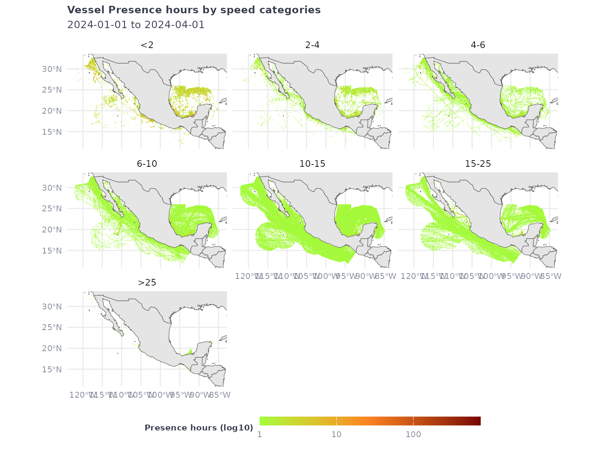
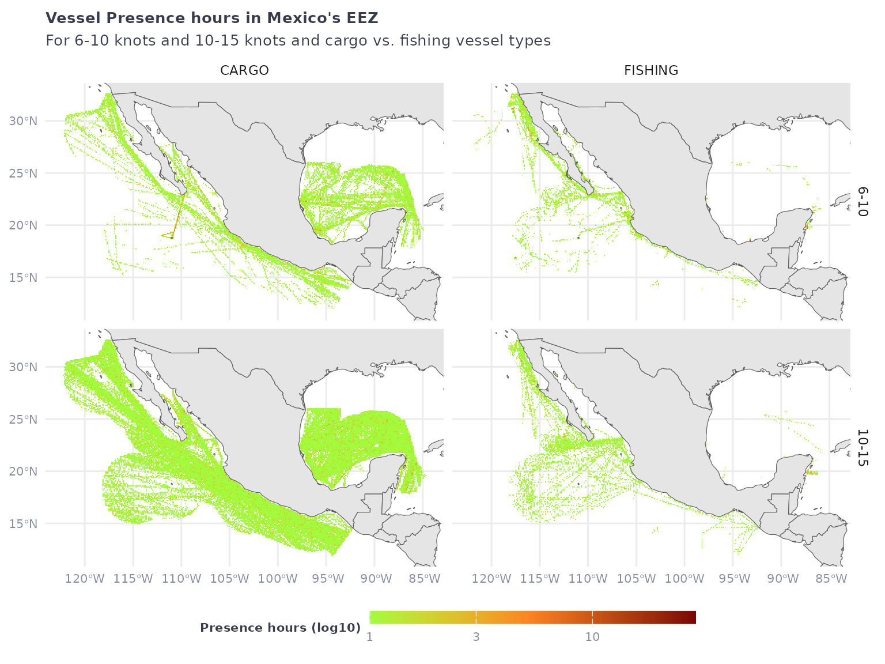
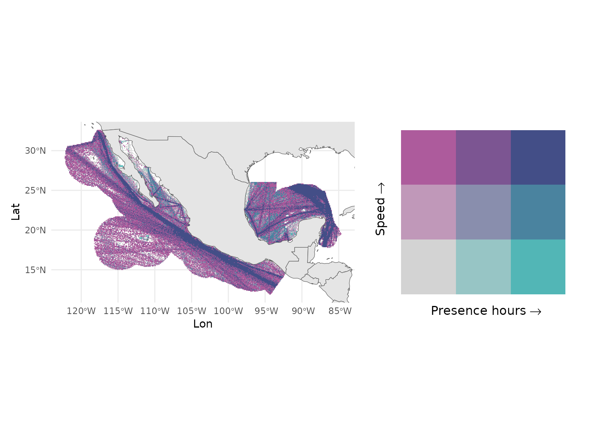

# Exploring the vessel presence layer in \`gfwr\`

## Overview

The
[`gfw_ais_presence()`](https://globalfishingwatch.github.io/gfwr/reference/gfw_ais_presence.md)
function provides gridded vessel presence data from Global Fishing
Watch’s [4Wings Map Visualization
API](https://globalfishingwatch.org/our-apis/documentation#map-visualization-4wings-api).
Global Fishing Watch’s vessel presence layer includes all vessel types,
fishing or not, and summarizes their presence in hours, based on the
data transmitted by their AIS transponders.

In this vignette we will explore several ways to call this function, and
the filters that have been implemented in our APIs to support the
exploration of this layer.

## Setup

To get started, first load the `gfwr` package and some of the packages
we will use

``` r
library(gfwr)
```

    ## ℹ Loading gfwr

``` r
library(dplyr)
library(tidyr)
library(ggplot2)
library(rnaturalearth)
library(rnaturalearthdata)
library(glue)
library(viridis)
library(forcats)
library(biscale)
library(patchwork)
```

We will fetch data for January-March 2024. **Remember the date intervals
in `gfwr` include the start of the interval and *exclude the last date*
of the interval**:

``` r
start_date <- '2024-01-01' # will be included
end_date <- '2024-04-01'   # will be excluded. search will be up to 2024-03-31
```

## Handling pre-built regions: MPAs, RFMOs, and EEZs

[`gfw_ais_presence()`](https://globalfishingwatch.github.io/gfwr/reference/gfw_ais_presence.md)
was designed to provide data for a specific region, offering users the
ability to select from multiple built-in region types by specifying a
specific Exclusive Economic Zone (EEZ), Marine Protected Area (MPA), or
Regional Fisheries Management Organization (RFMO).

> **Note:** The use of a region is mandatory, as the API is not designed
> to handle global requests

The list of available regions for each type, and their `label` and `id`,
can be accessed with the
[`gfw_regions()`](https://globalfishingwatch.github.io/gfwr/reference/gfw_regions.md)
function.

``` r
eez_regions <- gfw_regions(region_source = 'EEZ')
eez_regions
## # A tibble: 285 × 5
##    iso   label                          id GEONAME                      POL_TYPE
##    <chr> <chr>                       <dbl> <chr>                        <chr>   
##  1 ASM   American Samoa               8444 United States Exclusive Eco… 200NM   
##  2 SHN   Ascension                    8379 British Exclusive Economic … 200NM   
##  3 COK   Cook Islands                 8446 New Zealand Exclusive Econo… 200NM   
##  4 FLK   Falkland / Malvinas Islands  8389 Overlapping claim Falkland … Overlap…
##  5 PYF   French Polynesia             8440 French Exclusive Economic Z… 200NM   
##  6 PCN   Pitcairn                     8439 British Exclusive Economic … 200NM   
##  7 SHN   Saint Helena                 8380 British Exclusive Economic … 200NM   
##  8 WSM   Samoa                        8445 Samoan Exclusive Economic Z… 200NM   
##  9 TON   Tonga                        8448 Tongan Exclusive Economic Z… 200NM   
## 10 SHN   Tristan da Cunha             8382 British Exclusive Economic … 200NM   
## # ℹ 275 more rows
```

`gfwr` also includes the
[`gfw_region_id()`](https://globalfishingwatch.github.io/gfwr/reference/gfw_region_id.md)
function to get the `label` and `id` for a specific region using the
`region` argument. For EEZs, `region` corresponds to the name or the
country or the ISO3 code. Note that, for some countries, the name will
return multiple regions. For RFMOs, `region` corresponds to the RFMO
abbreviation (e.g. `"ICCAT"`) and for MPAs it refers to the name of the
MPA.

To fetch the numeric code of the Senegal EEZ, let’s use
[`gfw_region_id()`](https://globalfishingwatch.github.io/gfwr/reference/gfw_region_id.md)

``` r
# Use gfw_region_id function to get EEZ code for Senegal
senegal_eez_code <- gfw_region_id(region = "Senegal", region_source = "EEZ")
senegal_eez_code
## # A tibble: 2 × 5
##   iso3  label                                         id GEONAME        POL_TYPE
##   <chr> <chr>                                      <dbl> <chr>          <chr>   
## 1 NA    Joint regime area: Senegal / Guinea-Bissau 48964 Joint regime … Joint r…
## 2 SEN   Senegal                                     8371 Senegalese Ex… 200NM
```

The results show the EEZ and a Joint regime area. We will pick the EEZ
code, `8371`.

## Calling the function

The
[`gfw_ais_presence()`](https://globalfishingwatch.github.io/gfwr/reference/gfw_ais_presence.md)
function allows users to specify multiple criteria to customize the data
they download, including the date range, spatial and temporal
resolution, and grouping variables. See the documentation for
[`gfw_ais_presence()`](https://globalfishingwatch.github.io/gfwr/reference/gfw_ais_presence.md)
or the [GFW
APIs](https://globalfishingwatch.org/our-apis/documentation#report-url-parameters-for-both-post-and-get-requests)
for more info about these parameter options.

Spatial resolution can be LOW = 0.1 degree or HIGH = 0.01 degree,

``` r
vp_senegal <- gfw_ais_presence(spatial_resolution = "LOW",
                               temporal_resolution = "MONTHLY",
                               start_date = start_date,
                               end_date = end_date,
                               region_source = "EEZ",
                               region = 8371)
vp_senegal
## # A tibble: 4,183 × 5
##      Lat   Lon `Time Range` `Vessel IDs` `Vessel Presence Hours`
##    <dbl> <dbl> <chr>               <dbl>                   <dbl>
##  1  14.5 -18   2024-02                55                     100
##  2  11.6 -18.1 2024-01                22                      23
##  3  11.4 -19.3 2024-01                10                      12
##  4  14.2 -20   2024-01                 1                       1
##  5  13.8 -20   2024-03                 3                       3
##  6  13   -17.5 2024-01                28                      60
##  7  14.6 -18.5 2024-03                36                      43
##  8  15.4 -18.5 2024-02                33                      37
##  9  11.9 -17.7 2024-02                56                      63
## 10  11.8 -18.9 2024-02                10                      13
## # ℹ 4,173 more rows
```

Without grouping variables, the function will return a number of
`vessel ID`s present (for a definition of `Vessel ID` see our [vessel
identity
vignette](https://globalfishingwatch.github.io/gfwr/articles/identity))
and the total vessel presence hours for each cell (lat, lon).

The `Time Range` column will be expressed in the temporal units of the
temporal resolution selected. In this example, `MONTHLY` will create a
Time Range expressed in months: `YYYY-MM`

Explore other temporal resolution and how the results vary.

``` r
vp_senegal <- gfw_ais_presence(spatial_resolution = "LOW",
                               temporal_resolution = "YEARLY",
                               start_date = start_date,
                               end_date = end_date,
                               region_source = "EEZ",
                               region = 8371)
vp_senegal
## # A tibble: 1,446 × 5
##      Lat   Lon `Time Range` `Vessel IDs` `Vessel Presence Hours`
##    <dbl> <dbl>        <dbl>        <dbl>                   <dbl>
##  1  13.9 -18           2024          154                     179
##  2  11.4 -19.9         2024           10                      11
##  3  12   -18.5         2024           50                      58
##  4  15.8 -19.5         2024            9                      10
##  5  12.4 -17.7         2024          192                     238
##  6  12.3 -18.9         2024           22                      27
##  7  12.2 -19.6         2024            5                       5
##  8  15.4 -16.8         2024            1                       1
##  9  14.4 -19.4         2024           20                      23
## 10  15.6 -17.6         2024           34                      54
## # ℹ 1,436 more rows
```

## Grouping variables

The outputs of
[`gfw_ais_presence()`](https://globalfishingwatch.github.io/gfwr/reference/gfw_ais_presence.md)
can be grouped by `FLAG`, `GEARTYPE`, `FLAGANDGEARTYPE`, `MMSI` or
`VESSEL_ID`. This will create extra grouping columns, and the number of
vessel presence hours will be expressed accordingly.

``` r
vp_senegal_flag <- gfw_ais_presence(spatial_resolution = "LOW",
                                    temporal_resolution = "MONTHLY",
                                    group_by = "FLAG",
                                    start_date = start_date,
                                    end_date = end_date,
                                    region_source = "EEZ",
                                    region = 8371)
vp_senegal_flag |> count(flag) |> arrange((desc(n)))
## # A tibble: 84 × 2
##    flag      n
##    <chr> <int>
##  1 LBR    2901
##  2 MHL    2885
##  3 PAN    2641
##  4 MLT    2041
##  5 SGP    1907
##  6 BHS    1706
##  7 HKG    1613
##  8 ATG    1297
##  9 NOR    1292
## 10 PRT    1283
## # ℹ 74 more rows
```

**Note** that these results are grouped by `Vessel ID`, which is not the
same as grouping by number of vessels. Check our [vessel identity
vignette](https://globalfishingwatch.github.io/gfwr/articles/identity)
for more information.

Grouping by MMSI will group the results at the MMSI scale, which can
correspond to individual vessels, but this is not always the case.

``` r
vp_senegal_MMSI <- gfw_ais_presence(spatial_resolution = "LOW",
                                    temporal_resolution = "MONTHLY",
                                    group_by = "MMSI",
                                    start_date = start_date,
                                    end_date = end_date,
                                    region_source = "EEZ",
                                    region = 8371)
vp_senegal_MMSI
## # A tibble: 79,517 × 7
##      Lat   Lon `Time Range`      mmsi `Entry Timestamp`   `Exit Timestamp`   
##    <dbl> <dbl> <chr>            <dbl> <dttm>              <dttm>             
##  1  12.6 -18   2024-03      636022921 2024-02-23 11:00:00 2024-03-26 06:00:00
##  2  13.8 -17.9 2024-03      256615000 2024-03-01 17:00:00 2024-03-31 23:00:00
##  3  12.8 -18.5 2024-02      312599000 2024-01-01 00:00:00 2024-03-19 01:00:00
##  4  12.7 -19.1 2024-03      636021311 2024-03-15 09:00:00 2024-03-16 09:00:00
##  5  15.4 -17.9 2024-03      257497000 2024-03-02 23:00:00 2024-03-04 00:00:00
##  6  15.2 -18.9 2024-03      538009703 2024-02-11 05:00:00 2024-03-23 22:00:00
##  7  15.2 -18   2024-01      255806252 2024-01-21 03:00:00 2024-01-21 22:00:00
##  8  12.1 -18.2 2024-03      259081000 2024-03-13 19:00:00 2024-03-16 00:00:00
##  9  14.1 -19.8 2024-03      310479000 2024-03-04 12:00:00 2024-03-28 09:00:00
## 10  14.4 -19.3 2024-01      311000810 2024-01-17 00:00:00 2024-01-18 03:00:00
## # ℹ 79,507 more rows
## # ℹ 1 more variable: `Vessel Presence Hours` <dbl>
```

Finally, grouping by `Vessel ID` not only returns the `Vessel ID`s of
the active vessels in the area, it also returns all the identity details
about the vessels. Knowing this can help a lot in workflows that need
detailed information about vessel identity, gears, and characteristics.

``` r
vp_senegal_vesselID <- gfw_ais_presence(spatial_resolution = "LOW",
                                        temporal_resolution = "MONTHLY",
                                        group_by = "VESSEL_ID",
                                        start_date = start_date,
                                        end_date = end_date,
                                        region_source = "EEZ",
                                        region = 8371)
vp_senegal_vesselID
## # A tibble: 79,535 × 16
##      Lat   Lon `Time Range` `Vessel ID`  Flag  `Vessel Name` `Entry Timestamp`  
##    <dbl> <dbl> <chr>        <chr>        <chr> <chr>         <dttm>             
##  1  15.2 -18.3 2024-02      93323f113-3… MHL   GENCO MAGIC   2024-02-12 22:00:00
##  2  12.7 -17.7 2024-03      ec156ddd3-3… SGP   MAERSK CONGO  2024-01-03 11:00:00
##  3  14.5 -17.8 2024-02      eb11b5597-7… MHL   STAR CLEO     2024-02-20 13:00:00
##  4  12.8 -17.2 2024-01      f976133c6-6… PLW   ZAGOR         2024-01-11 04:00:00
##  5  15.1 -19.1 2024-03      02ab329d1-1… HKG   FRONT SUEZ    2024-02-05 20:00:00
##  6  15.3 -17.4 2024-03      5cec5686e-e… NOR   STADT KINN    2024-01-28 07:00:00
##  7  15.6 -18   2024-03      76ecd61f5-5… BRB   IDA           2024-03-26 18:00:00
##  8  15   -17.7 2024-03      28efc6ece-e… PRT   MSC TALIA F   2024-01-02 14:00:00
##  9  14.6 -17.8 2024-01      0a981eeba-a… LBR   MH PHOENIX B… 2024-01-14 11:00:00
## 10  13   -18   2024-03      32a3c474e-e… LBR   MSC MICHELCA… 2024-02-09 21:00:00
## # ℹ 79,525 more rows
## # ℹ 9 more variables: `Exit Timestamp` <dttm>, `Gear Type` <chr>,
## #   `Vessel Type` <chr>, MMSI <dbl>, IMO <dbl>, CallSign <chr>,
## #   `First Transmission Date` <dttm>, `Last Transmission Date` <dttm>,
## #   `Vessel Presence Hours` <dbl>
```

The columns include Lat, Lon, Time Range, Vessel ID, Flag, Vessel Name,
Entry Timestamp, Exit Timestamp, Gear Type, Vessel Type, MMSI, IMO,
CallSign, First Transmission Date, Last Transmission Date, Vessel
Presence Hours.

``` r
vp_senegal_vesselID |> count(`Gear Type`)
## # A tibble: 17 × 2
##    `Gear Type`             n
##    <chr>               <int>
##  1 BUNKER                278
##  2 CARGO               40039
##  3 CARRIER              2024
##  4 DRIFTING_LONGLINES    349
##  5 FISHING               435
##  6 GEAR                   29
##  7 INCONCLUSIVE          386
##  8 OTHER               27771
##  9 OTHER_PURSE_SEINES     62
## 10 PASSENGER            1313
## 11 POLE_AND_LINE          18
## 12 PURSE_SEINES           56
## 13 PURSE_SEINE_SUPPORT    25
## 14 SEISMIC_VESSEL        414
## 15 SET_LONGLINES          46
## 16 TRAWLERS             5893
## 17 TUNA_PURSE_SEINES     397
vp_senegal_vesselID |> count(`Vessel Type`)
## # A tibble: 9 × 2
##   `Vessel Type`      n
##   <chr>          <int>
## 1 BUNKER           278
## 2 CARGO          40052
## 3 CARRIER         2024
## 4 FISHING         7643
## 5 GEAR              33
## 6 OTHER          27753
## 7 PASSENGER       1313
## 8 SEISMIC_VESSEL   414
## 9 SUPPORT           25
```

## Mapping vessel presence with ggplot2

Before mapping let’s define a theme using `ggplot2`

``` r
# Map theme with dark background
map_theme <- ggplot2::theme_minimal() + 
  ggplot2::theme(
    panel.border = element_blank(), 
    legend.position = "bottom", legend.box = "vertical", 
    legend.key.height = unit(3, "mm"), 
    legend.key.width = unit(15, "mm"),
    legend.text = element_text(color = "#848b9b", size = 8), 
    legend.title = element_text(face = "bold", color = "#363c4c", size = 8, hjust = 0.5), 
    plot.title = element_text(face = "bold", color = "#363c4c", size = 10), 
    plot.subtitle = element_text(color = "#363c4c", size = 10), 
    axis.title = element_blank(), 
    axis.text = element_text(color = "#848b9b", size = 8)
    )

map_speed_light <- viridis::turbo(3, begin = 0.5)
```

And let’s map the original vessel presence dataset for January-March
2024:

``` r
vp_senegal
## # A tibble: 1,446 × 5
##      Lat   Lon `Time Range` `Vessel IDs` `Vessel Presence Hours`
##    <dbl> <dbl>        <dbl>        <dbl>                   <dbl>
##  1  13.9 -18           2024          154                     179
##  2  11.4 -19.9         2024           10                      11
##  3  12   -18.5         2024           50                      58
##  4  15.8 -19.5         2024            9                      10
##  5  12.4 -17.7         2024          192                     238
##  6  12.3 -18.9         2024           22                      27
##  7  12.2 -19.6         2024            5                       5
##  8  15.4 -16.8         2024            1                       1
##  9  14.4 -19.4         2024           20                      23
## 10  15.6 -17.6         2024           34                      54
## # ℹ 1,436 more rows
```

We can use `ggplot2` and `geom_tile` to plot the data.

``` r
vp_senegal |> 
  ggplot() +
  geom_tile(aes(x = Lon,
                y = Lat,
                fill = `Vessel Presence Hours`)) +
  geom_sf(data = ne_countries(returnclass = "sf", scale = "medium")) +
  coord_sf(xlim = c(min(vp_senegal$Lon), max(vp_senegal$Lon)),
           ylim = c(min(vp_senegal$Lat), max(vp_senegal$Lat))) +
  scale_fill_gradientn(
    transform = 'log10',
    colors = map_speed_light, 
    na.value = NA,
    labels = scales::comma) +
  labs(title = "Vessel Presence hours in the Senegalese EEZ",
       subtitle = glue("{start_date} to {end_date}"),
       fill = "Vessel presence hours (log)") +
  map_theme
```


## Using the speed filter

`gfw_ais_vessel_presence()` supports filtering the vessels by speed
range (in knots) in the following categories :

- \<2 – Less than 2 knots
- 2-4 – 2 to 4 knots
- 4-6 – 4 to 6 knots
- 6-10 – 6 to 10 knots
- 10-15 – 10 to 15 knots
- 15-25 – 15 to 25 knots
- \>25 – Greater than 25 knots

The filter syntax is adding the category: `filter_by = "speed = '<2'"`

Using the filter will subset the activity raster to the activity that
happened in the speed range:

``` r
eez_vessel_presence_speed <- gfw_ais_presence(
  spatial_resolution = "LOW",
  temporal_resolution = "MONTHLY",
  group_by = "FLAG",
  filter_by = "speed = '6-10'",
  start_date = start_date,
  end_date = end_date,
  region = 8371,
  region_source = "EEZ"
  )
eez_vessel_presence_speed
## # A tibble: 9,402 × 6
##      Lat   Lon `Time Range` flag  `Vessel IDs` `Vessel Presence Hours`
##    <dbl> <dbl> <chr>        <chr>        <dbl>                   <dbl>
##  1  15.6 -17.8 2024-03      ATG              1                       2
##  2  15   -18.2 2024-03      MHL              1                       1
##  3  16.1 -17.1 2024-03      PAN              1                       4
##  4  13.6 -17.5 2024-02      BLZ              1                       1
##  5  15.2 -17.2 2024-01      LBR              1                       1
##  6  14.2 -17.5 2024-01      ESP              1                       1
##  7  13.9 -17.9 2024-02      HKG              1                       2
##  8  15.1 -17.7 2024-01      LBR              2                       2
##  9  15.6 -18.6 2024-03      LBR              1                       1
## 10  15.7 -18.1 2024-03      LBR              1                       1
## # ℹ 9,392 more rows
```

> *Note:* The output won’t have an indication of the speed filter that
> was used, so a recommendation is to add a column `speed` to the output
> before merging with other speed bins. This is also a reason why using
> logical clauses like
> `filter_by = "speed = '6-10' AND speed = '10-15'"` is not very useful
> if you want to be able to keep the bins apart.

The speed filter will be a subset of the overall vessel presence


### Retrieving multiple speed classes

To retrieve data binned in multiple (or all) speed classes, we can loop
across the desired speed categories. Let’s make another example in the
Mexico EEZ.

``` r
id <- gfw_region_id("Mexico") |> 
  filter(POL_TYPE == "200NM") |> 
  dplyr::pull(id)
speed_categories <- c("<2",
                      "2-4",
                      "4-6",
                      "6-10",
                      "10-15",
                      "15-25",
                      ">25")

# we create the filters for each
sp <- paste0("speed = '" , speed_categories, "'")

vp_all_speeds <- purrr::map(sp,
                           ~gfw_ais_presence(
                             spatial_resolution = "LOW",
                             temporal_resolution = "MONTHLY",
                             group_by = "VESSEL_ID",
                             filter_by = .x,
                             start_date = start_date,
                             end_date = end_date,
                             region = id, 
                             region_source = "EEZ"))
# adding a speed column to help aggregate the data
vp_all_speeds <- purrr::map2(vp_all_speeds,
                             speed_categories, 
                             ~mutate(.x, speed = .y)) |>
  bind_rows()

# reorganizing factor levels 
vp_all_speeds <- vp_all_speeds |>
  mutate(speed = as.factor(speed)) |> 
  mutate(speed = forcats::fct_relevel(speed, c("<2",
                                               "2-4",
                                               "4-6",
                                               "6-10",
                                               "10-15",
                                               "15-25",
                                               ">25")))
  
vp_all_speeds |>   
ggplot() +
  geom_tile(aes(x = Lon,
                y = Lat,
                fill = `Vessel Presence Hours`)) +
  geom_sf(data = ne_countries(returnclass = "sf", scale = "medium")) +
  coord_sf(xlim = c(min(vp_all_speeds$Lon),
                    max(vp_all_speeds$Lon)),
           ylim = c(min(vp_all_speeds$Lat),
                    max(vp_all_speeds$Lat))) +
  scale_fill_gradientn(
    transform = 'log10',
    colors = map_speed_light, 
    na.value = NA,
    labels = scales::comma) +
  facet_wrap(~speed) +
  labs(title = "Vessel Presence hours by speed categories",
       subtitle = glue("{start_date} to {end_date}"),
       fill = "Presence hours (log10)") +
  map_theme
```



Since the request retrieved the data grouped by `vessel ID`, we have
gear types, vessel types and other identity markers that can help filter
and refine the visualization.

``` r
vp_all_speeds |>   
  filter(`Vessel Type` %in% c("FISHING", "CARGO"),
         speed %in% c("6-10", "10-15")) |> 
  ggplot() +
  geom_tile(aes(x = Lon,
                y = Lat,
                fill = `Vessel Presence Hours`)) +
  geom_sf(data = ne_countries(returnclass = "sf", scale = "medium")) +
  coord_sf(xlim = c(min(vp_all_speeds$Lon),
                    max(vp_all_speeds$Lon)),
           ylim = c(min(vp_all_speeds$Lat),
                    max(vp_all_speeds$Lat))) +
  scale_fill_gradientn(
    transform = 'log10',
    colors = map_speed_light, 
    na.value = NA,
    labels = scales::comma) +
  facet_grid(speed~`Vessel Type`) +
  labs(title = "Vessel Presence hours in Mexico's EEZ",
       subtitle = paste("For 6-10 knots and 10-15 knots and cargo vs. fishing vessel types"),
       fill = "Presence hours (log10)")  + 
  map_theme
```



### Bivariate plots of speed and vessel presence hours

Vessel presence and speed may be better visualized using a bivariate
plot, to distinguish areas with different levels of vessel density from
areas where vessels transit at high or low speeds.

``` r
vp_all_speeds <- vp_all_speeds |> 
  mutate(speed_nb = case_when(
    speed == "<2" ~ 2, 
    speed == "2-4" ~ 4, 
    speed == "4-6" ~ 6, 
    speed == "6-10" ~ 10, 
    speed == "10-15" ~ 15, 
    speed == "15-25" ~ 25, 
    speed == ">25" ~ 50))

biscale_speeds <- vp_all_speeds |> 
  group_by(Lat, Lon, speed_nb) |> 
  summarize(vessel_presence_hours = sum(`Vessel Presence Hours`)) |>
  biscale::bi_class(x = vessel_presence_hours, 
                    y = speed_nb, style = "quantile")

speed_map <- biscale_speeds |> 
ggplot() +
  geom_tile(aes(x = Lon,
                y = Lat,
                fill = bi_class)) +
  geom_sf(data = ne_countries(returnclass = "sf", scale = "medium")) +
  coord_sf(xlim = c(min(biscale_speeds$Lon), 
                    max(biscale_speeds$Lon)),
           ylim = c(min(biscale_speeds$Lat),
                    max(biscale_speeds$Lat))) +
  bi_scale_fill(pal = "DkBlue2") + 
  theme_minimal() +
  theme(legend.position = "none")
  p_legend <- bi_legend(pal = "DkBlue2",
                        xlab = "Presence hours",
                        ylab = "Speed",
                        dim = 3,
                        size = 12)
p_combo <- (speed_map + p_legend) 
p_combo
```


