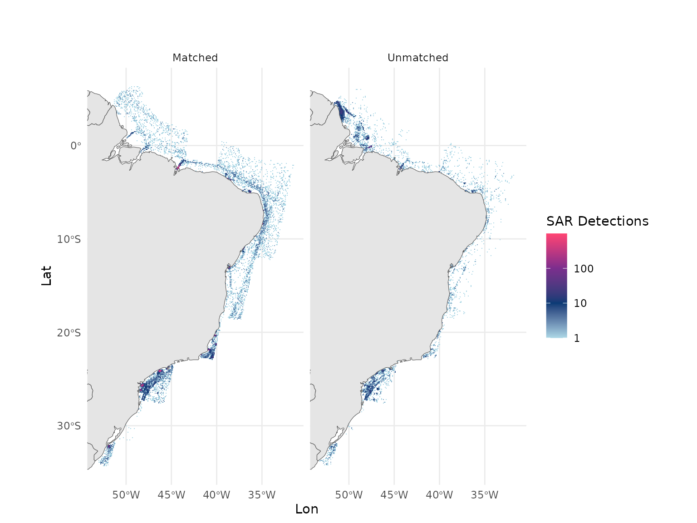

# Introduction to SAR vessel detections

``` r
library(gfwr)
```

``` r
library(dplyr)
library(ggplot2)
```

Function
[`gfw_sar_vessel_detections()`](https://globalfishingwatch.github.io/gfwr/reference/gfw_sar_vessel_detections.md)
allows users to access Global Fishing Watch’s dataset containing vessels
detections using **Sentinel-1 Synthetic Aperture Radar (SAR)**,
initially published in [Paolo *et al.*
2024](https://doi.org/10.1038/s41586-023-06825-8).

This dataset is available publicly in Global Fishing Watch platforms,
including our map, APIs, and R and python packages.

[`gfw_sar_vessel_detections()`](https://globalfishingwatch.github.io/gfwr/reference/gfw_sar_vessel_detections.md)
has the same general structure of functions
[`gfw_ais_presence()`](https://globalfishingwatch.github.io/gfwr/reference/gfw_ais_presence.md)
and
[`gfw_ais_fishing_hours()`](https://globalfishingwatch.github.io/gfwr/reference/gfw_ais_fishing_hours.md),
with arguments for spatial and temporal resolution, start and end dates,
region options, and options for grouping and filtering the results.

For more details about the usage of these parameters, please refer to
the help menus in the function and to the [vessel
presence](https://globalfishingwatch.github.io/gfwr/articles/vessel-presence.html)
and [fishing
activity](https://globalfishingwatch.github.io/gfwr/articles/fishing_activity_maps.html)
vignettes.

``` r
gfw_sar_vessel_detections(spatial_resolution = NULL,
                          temporal_resolution = NULL,
                          start_date = NULL,
                          end_date = NULL,
                          region_source = NULL,
                          region = NULL,
                          group_by = NULL,
                          filter_by = NULL,
                          key = gfw_auth(),
                          print_request = FALSE)
```

## SAR and AIS matching

A key characteristic of the SAR vessel detections dataset is that SAR
vessel detections go through a **matching process** with AIS
transmissions. For details about the matching process, please refer to
[Paolo *et al.* 2024](https://doi.org/10.1038/s41586-023-06825-8).

Matched detections have therefore vessel identity information and other
characteristics available in Global Fishing Watch AIS pipelines.

Unmatched detections can happen for several reasons, including that:

- Not all vessels are required to use AIS devices, as regulations vary
  by country, vessel size, and activity.

- There are large “blind spots” along coastal waters, arising from
  restrictions to access AIS data by satellites, or from **poor
  reception** due to high vessel density and low-quality AIS devices.

- Vessels can turn off their AIS transponders or manipulate the
  locations they broadcast, operating “in the dark”, often against
  regulations. Not every vessel that turns off its transponder is
  necessarily engaging in suspicious or illicit activities, but the
  contrary tends to be true.

## Basic usage

A simple call, with no `group_by` or `filter_by` options will return a
simple `tibble` object with the number of `vesselIDs` detected and the
number of detections by pixel, at the requested resolution.

Let’s request the monthly detections in the Brazil EEZ for 2023.

``` r
id <- gfw_region_id(region = "Brazil", region_source = "EEZ") |> 
  # to select only the ids corresponding to EEZs
  filter(POL_TYPE == "200NM") |> 
  dplyr::pull(id)

(brazil_sar <- gfw_sar_vessel_detections(spatial_resolution = "LOW",
                                         temporal_resolution = "MONTHLY",
                                         start_date = "2023-01-01",
                                         end_date = "2024-01-01",
                                         region_source = "EEZ",
                                         region = id))
#> # A tibble: 11,522 × 5
#>      Lat   Lon `Time Range` `Vessel IDs` Detections
#>    <dbl> <dbl> <chr>               <dbl>      <dbl>
#>  1   4.2 -50.9 2023-04                 1          1
#>  2 -24.8 -47.5 2023-01                 1          1
#>  3 -15.3 -38.5 2023-06                 1          1
#>  4 -34   -52   2023-03                 1          1
#>  5  -0.7 -37.5 2023-07                 1          1
#>  6  -2.4 -44.2 2023-06                15         25
#>  7  -9.5 -33.4 2023-05                 1          1
#>  8 -27.1 -46.8 2023-01                 1          1
#>  9   4.4 -51   2023-10                 1          1
#> 10  -2.1 -44.2 2023-07                 2          2
#> # ℹ 11,512 more rows
```

### `group_by`

[`gfw_sar_vessel_detections()`](https://globalfishingwatch.github.io/gfwr/reference/gfw_sar_vessel_detections.md)
has the same `group_by` options than `gfw_ais_vessel_presence()` and
[`gfw_ais_fishing_hours()`](https://globalfishingwatch.github.io/gfwr/reference/gfw_ais_fishing_hours.md):
`FLAG`, `GEARTYPE`, `FLAGANDGEARTYPE`, `MMSI` and `VESSELID`.

Like in these other functions, `group_by = "VESSEL_ID"` returns all
available identity fields.

However,
[`gfw_sar_vessel_detections()`](https://globalfishingwatch.github.io/gfwr/reference/gfw_sar_vessel_detections.md)
results can contain `NA` values corresponding to unmatched detections.

Let’s repeat the request, this time grouping by MMSI:

``` r
(sar_by_mmsi <- gfw_sar_vessel_detections(spatial_resolution = "LOW",
                                          temporal_resolution = "MONTHLY",
                                          group_by = "MMSI",
                                          start_date = "2023-01-01",
                                          end_date = "2024-01-01",
                                          region_source = "EEZ",
                                          region = id))
#> # A tibble: 20,996 × 7
#>      Lat   Lon `Time Range`      mmsi `Entry Timestamp`   `Exit Timestamp`   
#>    <dbl> <dbl> <chr>            <dbl> <dttm>              <dttm>             
#>  1  -1.9 -32.3 2023-10      538009746 2023-10-02 07:52:54 2023-10-02 07:52:54
#>  2 -13   -38.6 2023-03      636015411 2023-03-10 08:11:58 2023-03-10 08:11:58
#>  3 -24.2 -46.4 2023-12      538006311 2023-12-21 08:31:36 2023-12-21 08:31:36
#>  4 -24.2 -46.2 2023-01      241768000 2023-01-31 08:31:30 2023-01-31 08:31:30
#>  5 -25.5 -48.4 2023-02      412289000 2023-01-12 08:40:16 2023-10-10 08:32:05
#>  6  -3.6 -38.4 2023-01      538005596 2023-01-12 08:33:49 2023-07-20 08:09:59
#>  7  -1.8 -43.9 2023-02      477118900 2023-02-20 21:17:36 2023-11-17 08:14:12
#>  8 -24.1 -46.2 2023-03      477752500 2023-03-08 08:31:29 2023-12-30 08:03:33
#>  9 -26.3 -47.6 2023-09      710001106 2023-05-07 08:31:58 2023-09-16 08:32:30
#> 10  -5.6 -34.8 2023-12      311001087 2023-12-30 08:01:53 2023-12-30 08:01:53
#> # ℹ 20,986 more rows
#> # ℹ 1 more variable: Detections <dbl>
```

In this example in the Brazilian EEZ, roughly a fifth of the detections
were unmatched to AIS.

``` r
sar_by_mmsi |> dplyr::count(is.na(mmsi))
#> # A tibble: 2 × 2
#>   `is.na(mmsi)`     n
#>   <lgl>         <int>
#> 1 FALSE         16566
#> 2 TRUE           4430
```

### `filter_by`

To filter only by matched or unmatched detections, the function allows
for options `"matched='true'"` and `"matched='false'"` in the
`filter_by` options:

> **Note:** When filters are applied, the API does not return any field
> indicating this, so we recommend adding a column to identify the
> datasets. Another option is to use `NA` values in the columns as
> indicators of unmatched detections.

Let’s fetch matched and unmatch detections, create a `matched` column
and bind the two tables to map matched and unmatched detections in the
region:

``` r
# matched ddetections 
matched_sar <- gfw_sar_vessel_detections(spatial_resolution = "LOW", 
                          temporal_resolution = "MONTHLY",
                          group_by = "VESSEL_ID",
                          start_date = "2023-01-01",
                          end_date = "2024-01-01",
                          region_source = "EEZ", 
                          region = id, 
                          filter_by = "matched='true'"
                          ) |> 
  mutate(matched = "Matched")

matched_sar
#> # A tibble: 16,585 × 17
#>      Lat   Lon `Time Range` `Vessel ID`  Flag  `Vessel Name` `Entry Timestamp`  
#>    <dbl> <dbl> <chr>        <chr>        <chr> <chr>         <dttm>             
#>  1 -25.7 -48.2 2023-09      99dd5c86f-f… CYP   OCEANIA GRAE… 2023-02-17 08:40:15
#>  2 -10.9 -36.9 2023-02      45513b744-4… MHL   SSI PROVIDEN… 2023-02-21 08:03:26
#>  3  -2.4 -44.2 2023-07      d0c3dfc4a-a… BHS   INES CORRADO  2023-07-02 21:17:41
#>  4 -26.2 -47.7 2023-09      29c294d96-6… BRA   WILLIAN SANT… 2023-02-22 08:50:49
#>  5 -24.1 -46.1 2023-04      6a0833667-7… MLT   LBC GREEN     2023-03-20 08:31:29
#>  6 -24.1 -46.1 2023-08      29e949513-3… MHL   HYDRUS        2023-03-08 08:31:29
#>  7 -16.7 -38.2 2023-01      78a168660-0… PRT   MSC CLEA      2023-01-28 08:04:42
#>  8   1.5 -47.2 2023-03      7797c8d4f-f… PAN   CRIMSON ARK   2023-03-04 08:57:20
#>  9 -24.1 -46.2 2023-01      9b04d4155-5… LBR   FENG MAY      2023-01-19 08:31:30
#> 10 -24.2 -46.3 2023-09      7b0efbfa5-5… CYM   STOLT SUN     2023-04-13 08:31:30
#> # ℹ 16,575 more rows
#> # ℹ 10 more variables: `Exit Timestamp` <dttm>, `Gear Type` <chr>,
#> #   `Vessel Type` <chr>, MMSI <dbl>, IMO <dbl>, CallSign <chr>,
#> #   `First Transmission Date` <dttm>, `Last Transmission Date` <dttm>,
#> #   Detections <dbl>, matched <chr>

# unmatched ddetections 

unmatched_sar <- gfw_sar_vessel_detections(spatial_resolution = "LOW",
                                           temporal_resolution = "MONTHLY",
                                           group_by = "VESSEL_ID",
                                           start_date = "2023-01-01",
                                           end_date = "2024-01-01",
                                           region_source = "EEZ",
                                           region = id,
                                           filter_by = "matched='false'") |>
  mutate(matched = "Unmatched")

# bind rows: 
(all_sar_detections <- dplyr::bind_rows(matched_sar, unmatched_sar))
#> # A tibble: 21,006 × 17
#>      Lat   Lon `Time Range` `Vessel ID`  Flag  `Vessel Name` `Entry Timestamp`  
#>    <dbl> <dbl> <chr>        <chr>        <chr> <chr>         <dttm>             
#>  1 -25.7 -48.2 2023-09      99dd5c86f-f… CYP   OCEANIA GRAE… 2023-02-17 08:40:15
#>  2 -10.9 -36.9 2023-02      45513b744-4… MHL   SSI PROVIDEN… 2023-02-21 08:03:26
#>  3  -2.4 -44.2 2023-07      d0c3dfc4a-a… BHS   INES CORRADO  2023-07-02 21:17:41
#>  4 -26.2 -47.7 2023-09      29c294d96-6… BRA   WILLIAN SANT… 2023-02-22 08:50:49
#>  5 -24.1 -46.1 2023-04      6a0833667-7… MLT   LBC GREEN     2023-03-20 08:31:29
#>  6 -24.1 -46.1 2023-08      29e949513-3… MHL   HYDRUS        2023-03-08 08:31:29
#>  7 -16.7 -38.2 2023-01      78a168660-0… PRT   MSC CLEA      2023-01-28 08:04:42
#>  8   1.5 -47.2 2023-03      7797c8d4f-f… PAN   CRIMSON ARK   2023-03-04 08:57:20
#>  9 -24.1 -46.2 2023-01      9b04d4155-5… LBR   FENG MAY      2023-01-19 08:31:30
#> 10 -24.2 -46.3 2023-09      7b0efbfa5-5… CYM   STOLT SUN     2023-04-13 08:31:30
#> # ℹ 20,996 more rows
#> # ℹ 10 more variables: `Exit Timestamp` <dttm>, `Gear Type` <chr>,
#> #   `Vessel Type` <chr>, MMSI <dbl>, IMO <dbl>, CallSign <chr>,
#> #   `First Transmission Date` <dttm>, `Last Transmission Date` <dttm>,
#> #   Detections <dbl>, matched <chr>
```

Let’s plot the resulting dataset:

``` r
sar_effort_light <- rev(c("#ff4573", "#7b2e8d", "#093b76", "lightblue"))

all_sar_detections |>
   group_by(Lat, Lon, matched) |>
   summarize(detections = sum(Detections, na.rm = T)) |>
   ggplot() +
   geom_tile(aes(x = Lon, y = Lat, fill = detections)) +
   geom_sf(data = rnaturalearth::ne_countries(returnclass = "sf", scale = "medium")) +
   coord_sf(xlim = c(min(all_sar_detections$Lon), max(all_sar_detections$Lon)),
            ylim = c(min(all_sar_detections$Lat), max(all_sar_detections$Lat))) +
   scale_fill_gradientn(
      trans = "log10",
      colors = sar_effort_light,
      na.value = "lightblue",
      labels = scales::label_comma()
   ) +
   labs(title = "",
        subtitle = "",
        fill = "SAR Detections") +
   theme(
      panel.background = element_rect(fill = "aliceblue"),
      axis.text.x = element_text(angle = 90),
      plot.background = element_rect(fill = "white")
   ) + 
  facet_grid(~matched) + 
  theme_minimal()
#> `summarise()` has regrouped the output.
#> ℹ Summaries were computed grouped by Lat, Lon, and matched.
#> ℹ Output is grouped by Lat and Lon.
#> ℹ Use `summarise(.groups = "drop_last")` to silence this message.
#> ℹ Use `summarise(.by = c(Lat, Lon, matched))` for per-operation grouping
#>   (`?dplyr::dplyr_by`) instead.
```



## References

Paolo, F., Kroodsma, D., Raynor, J., Hochberg, T., Davis, P., Cleary,
J., Marsaglia, L., Orofino, S., Thomas, C., Halpin, P., 2024. *Satellite
mapping reveals extensive industrial activity at sea.* Nature 625,
85–91. <https://doi.org/10.1038/s41586-023-06825-8>
